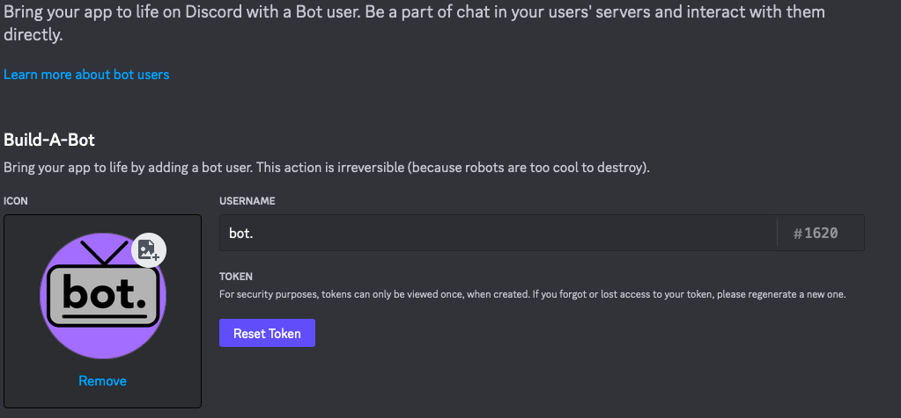

# bot.

A monolithic Discord bot.

## Basic Setup

### Token Setup

For your bot to work you must first create a Discord bot to do this you must go to [The Discord Developer Portal](https://discord.com/developers/applications) and create a bot. Once you sign in you have to create an application this is going to be your bot. 


Once you're there you're going to name your project whatever you want. (Note: This will not be the display name of your bot to other users. That step will come later.)


This is where you'll create your bot. Go to the Build-A-Bot in the Bot Section

 


Once you do that you'll generate a new user. This is what is shown to the people using your bot. Here you can change the public name and image. What you're going to need is the token. You sdhould also enable "Requires OAuth2 Code Grant" and if you want others to use your bot you need to enable "Public Bot" so others can  add it to their server.

 


Next we need the program to recognize this token. To do this save it to a file called `token.secret` in the root directory of the bot. install. You can use Notepad or any other text editing tool to edit this file. 

 

### Server Setup

To set up your bot to be visible in a server you need to go back to the Bot section in the Discord Developer Portal and enable all privileged gateway intents.


Next you will create a URL. This is what will enable your bot to join a server. In order for your bot to join a server you are going need  
administrator privileges in that server or else your bot will not be able to join. Then check the "bot" box and in the next section only enable the "Administrator" box.


You'll then get a link generated at the bottom of the page. Open it in a web browser and log in to Discord. Then select the server which you're going to put the bot into.


Your bot is now in a server follow the next section to bring your bot online.

## Running the bot

```bash
  git clone https://github.com/Gabe-N-Olivas/bot.
  cd bot.
  python3 main.py
```
If you want to run this in the background do the following (This is assuming this script is job #1 to be sure run `jobs` to see which job this script this is):

Do the key combo 'Ctrl+Z'
Then enter the following commands
```bash
  bg
  disown %1
```

## License

This project is licensed under the GPL V3.